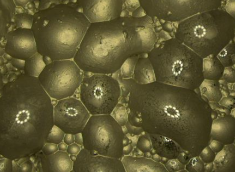
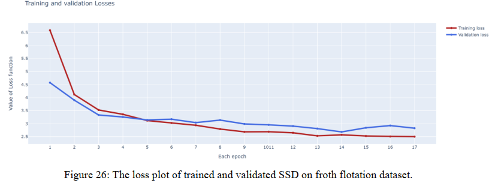
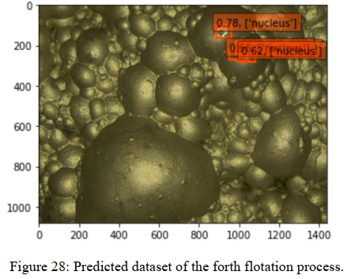

# Instance_segmentation_froth_flotation

Final project of university of Tabriz.
An state-of-the-art project based on froth flotataion process

# Single Shot Detector (SSD) with Residual network 50:
An state-of-the-art computer vision based algorithms so as to detected projected shadows of the dataset (objects) appropriately.

# Experiments:
I annotated more than a thousand of the froth flotation dataset by ‘labelimg’, and then converted
to a single file using pickle to a ‘.p’ file so as to train the whole annotated dataset easier.
Unfortunately, I was unable to train the whole dataset due to the fact that will be mentioned. Not
only, based on 27th figure, each epoch so as to be trained, took more than half an hour but also I
had to train my model on ‘Google colab’ which always halts on specific period of time.
Therefore, I could only train 500 of the froth flotation dataset with merely 17 epochs because
‘Goole colab’ did not let me train more. Finally, I could get normal mean average precision
accuracy, to be more precise recall/ precision on a ROC curve. If I could train more data with
more epochs, I got even better accuracy. In this problem, by these obstacles, I got at least 60%
(from 60% to 80%). Based on the differences of each image, this value can comfortably rise to
90%. Object detection is really difficult problem, and in order to train it, scientists usually use
image-net dataset which comprises more than a million data. However, I was not able to use it
since the froth flotation dataset is a unique dataset that transfer learning cannot improve its
accuracy. In my opinion, accuracy of more than 60%, and validation loss of less than 3 (figure
26) is fabulous in this problem because the labeling process is quite difficult since it requires the
factory’s operators experience so as to be annotated better.

# Conclusion:

